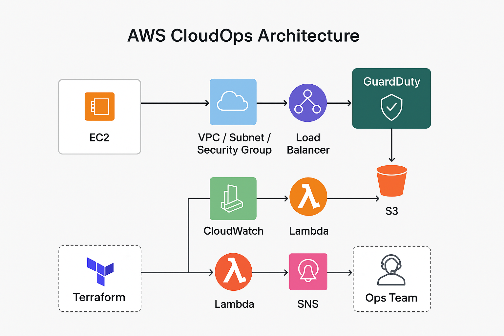

# 🚀 AWS CloudOps Suite

[](https://github.com/charles-bucher/AWS_Cloudops_Suite/stargazers)
[](https://github.com/charles-bucher/AWS_Cloudops_Suite/issues)
[](LICENSE)

---

## 👋 Overview

**AWS CloudOps Suite** is a hands-on learning repository simulating real-world AWS cloud support, monitoring, and automation workflows.  

- Practice **EC2, S3, IAM, Lambda, CloudWatch, and GuardDuty troubleshooting**  
- Automate tasks with **Python scripts, Terraform, and IaC templates**  
- Gain experience in **incident response, monitoring, and proactive CloudOps**  
- Perfect for **self-learners, career pivoters, and aspiring Cloud Support Engineers**  

---

## 🌟 Features

- Simulated AWS services: EC2, S3, IAM, Lambda, CloudWatch, GuardDuty  
- AI-assisted scenario guidance for troubleshooting  
- Hands-on exercises for incident response  
- Reusable Python scripts and Jupyter notebooks  
- Full screenshot walkthroughs illustrating workflow  

---

## 📂 Project Structure

AWS_Cloudops_Suite/
│
├─ diagrams/architecture/ # Architecture diagrams
│ └─ AWS_Cloudops_suite_Diagram.png
├─ screenshots/ # Visual walkthroughs of scenarios
├─ scripts/ # Python automation scripts
├─ notebooks/ # Jupyter notebooks for exercises
├─ requirements.txt # Python dependencies
├─ README.md
└─ aws_support_sim.py # Main simulator entry point

yaml
Copy code

---

## 🖼 Architecture Diagram



*Illustrates the workflow for monitoring, automation, Terraform IaC, and GuardDuty security alerts.*

---

## 📸 Screenshots – Workflow Overview

### 1️⃣ AWS CLI & Setup


### 2️⃣ IAM Configuration


### 3️⃣ DynamoDB Workflow


### 4️⃣ S3 Management


### 5️⃣ CloudWatch & Metrics Monitoring


### 6️⃣ Terraform Deployment & Verification


### 7️⃣ Lambda Functions


*All screenshots illustrate the workflow end-to-end, from setup → automation → monitoring → verification.*

---

## ⚡ Installation

```bash
git clone https://github.com/charles-bucher/AWS_Cloudops_Suite.git
cd AWS_Cloudops_Suite
python -m venv venv
.\venv\Scripts\activate
pip install -r requirements.txt
🖥 Usage
bash
Copy code
python aws_support_sim.py
Follow guided prompts to simulate scenarios:

Unauthorized IAM access

EC2 instance failures

S3 misconfigurations

Lambda function errors

CloudWatch alerts

🛠 Roadmap
Add RDS, VPC, Route53 simulations

Hands-on scoring challenges

Multi-user collaboration

Web interface for browser access

🔑 Keywords
cloudops, aws, terraform, python-automation, ec2, s3, iam, lambda, cloudwatch, guardduty, observability, security-automation, incident-response

📬 Contact
Author: Charles Bucher – self-taught Cloud Support Engineer

GitHub

LinkedIn

"Hands-on practice beats theory 10x when learning cloud operations."

yaml
Copy code

---
