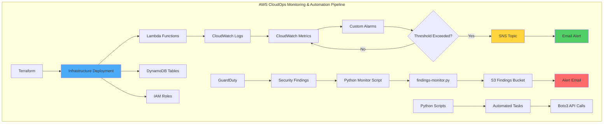
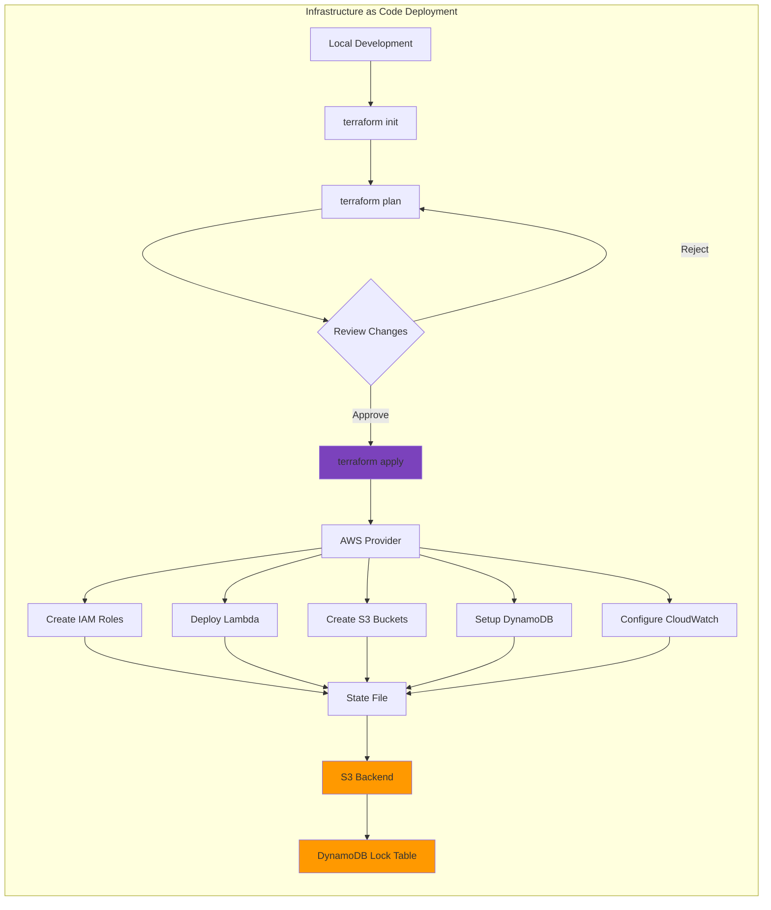
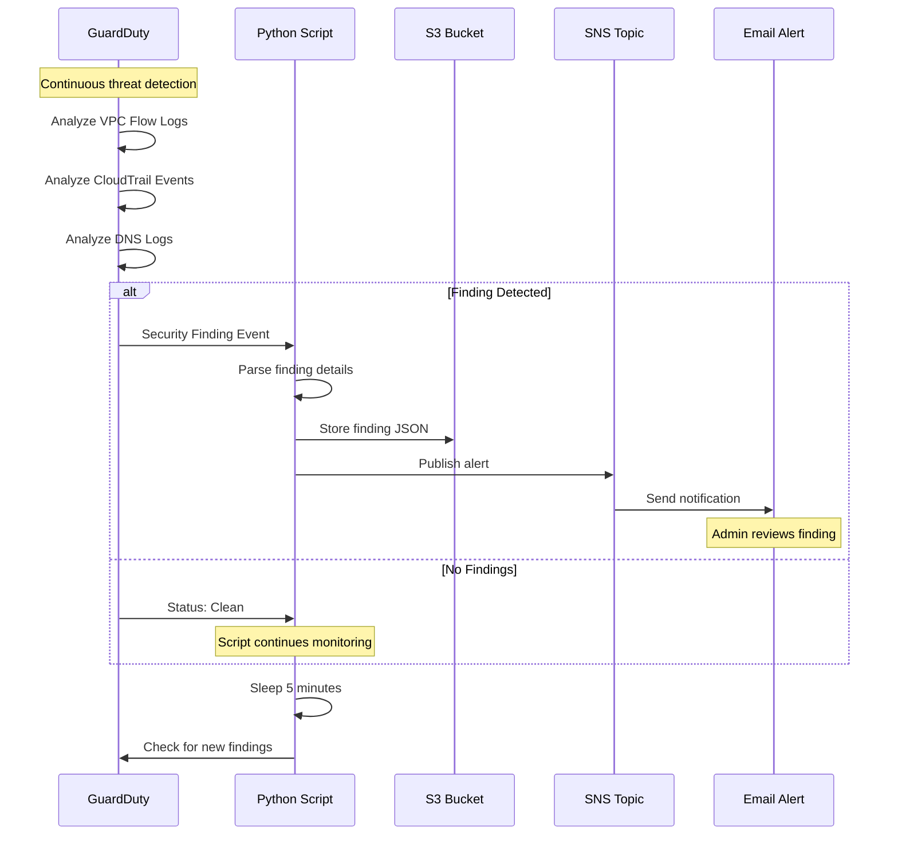
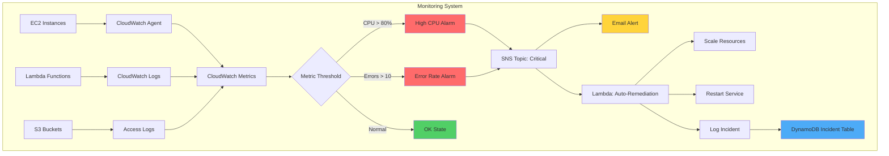
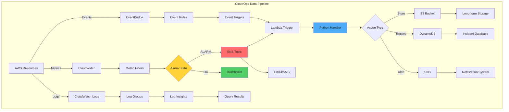

# AWS CloudOps Suite

[](https://aws.amazon.com/)
[](https://www.terraform.io/)
[](https://www.python.org/)
[](LICENSE)

> Hands-on AWS monitoring, alerting, and automation project built while learning CloudOps practices.

---

## 📋 What This Is

A personal learning project where I built an AWS monitoring and automation pipeline from scratch. This demonstrates practical skills in CloudWatch monitoring, Terraform infrastructure deployment, Python automation, and security monitoring with GuardDuty.

**Built for:** Demonstrating CloudOps and Cloud Support engineering skills for entry-level to junior positions.

---

## 🎯 Skills Demonstrated

| Skill Area | Technologies Used |
|------------|------------------|
| **Cloud Monitoring** | AWS CloudWatch metrics, alarms, dashboards |
| **Security Monitoring** | AWS GuardDuty, automated findings alerts |
| **Infrastructure as Code** | Terraform (HCL), backend state management |
| **Automation** | Python, Boto3 SDK, AWS CLI |
| **Serverless** | AWS Lambda functions |
| **Storage & Databases** | S3 buckets, DynamoDB tables |
| **Identity & Access** | IAM roles, policies, user permissions |

---

## 🏗️ System Architecture

### Overall CloudOps Pipeline



---

### Terraform Infrastructure Workflow



---

### GuardDuty Security Monitoring Flow



---

### CloudWatch Monitoring & Alerting



---

### Project Learning Phases

```mermaid
graph LR
    subgraph "Phase 1: Setup"
        A1[AWS CLI Config]
        A2[Boto3 Install]
        A3[Terraform v1.13.2]
    end
    
    subgraph "Phase 2: State Management"
        B1[S3 Backend]
        B2[DynamoDB Lock]
        B3[Secure Credentials]
    end
    
    subgraph "Phase 3: IAM & Security"
        C1[IAM Roles]
        C2[Policies]
        C3[User Permissions]
    end
    
    subgraph "Phase 4: Monitoring"
        D1[CloudWatch Metrics]
        D2[Custom Alarms]
        D3[Dashboards]
    end
    
    subgraph "Phase 5: Automation"
        E1[Lambda Functions]
        E2[Python Scripts]
        E3[S3 Storage]
    end
    
    subgraph "Phase 6: Infrastructure"
        F1[Terraform Deploy]
        F2[Outputs]
        F3[State Management]
    end
    
    A1 --> A2 --> A3
    A3 --> B1 --> B2 --> B3
    B3 --> C1 --> C2 --> C3
    C3 --> D1 --> D2 --> D3
    D3 --> E1 --> E2 --> E3
    E3 --> F1 --> F2 --> F3
    
    style A1 fill:#4dabf7
    style B1 fill:#4dabf7
    style C1 fill:#ff6b6b
    style D1 fill:#ffd43b
    style E1 fill:#51cf66
    style F1 fill:#7B42BC
```



---

### Data Flow Diagram



---

## 📸 Implementation Evidence

### Phase 1: Environment Setup

<details>
<summary>📋 AWS Configuration & Authentication</summary>

**AWS Access Key Configuration:**

*Configured AWS CLI with access keys for programmatic access*

**Backend State Configuration:**

*Set up Terraform backend for remote state management in S3*

**Boto3 SDK Installation:**

*Installed AWS SDK for Python (Boto3) for automation scripts*

**CLI Configuration Verification:**

*Verified AWS CLI configuration and credentials*

**CloudWatch Initial Setup:**

*Configured CloudWatch for metrics collection and monitoring*

</details>

---

### Phase 2: State Management & Database

<details>
<summary>📋 Terraform State & DynamoDB</summary>

**State Lock Confirmation:**

*Verified Terraform state locking mechanism*

**DynamoDB State Lock Table:**

*Created DynamoDB table for Terraform state locking to prevent concurrent modifications*

</details>

---

### Phase 3: Identity & Access Management

<details>
<summary>📋 IAM Roles & Permissions</summary>

**IAM Roles Created:**

*Configured IAM roles for Lambda functions and EC2 instances*

**User Permission Policies:**

*Applied least-privilege IAM policies for secure access control*

</details>

---

### Phase 4: Serverless Functions

<details>
<summary>📋 Lambda Deployment</summary>

**Lambda Functions Deployed:**

*Created Lambda functions for automated monitoring and alerting tasks*

</details>

---

### Phase 5: Monitoring & Metrics

<details>
<summary>📋 CloudWatch Metrics Dashboard</summary>

**Metrics Overview:**

*CloudWatch dashboard showing key infrastructure metrics*

**CPU Utilization Metrics:**

*Detailed CPU utilization tracking for EC2 instances*

**Custom Metric Configuration:**

*Custom CloudWatch metrics for application-specific monitoring*

</details>

---

### Phase 6: Automation & Storage

<details>
<summary>📋 Python Scripts & S3 Management</summary>

**Python Automation Script:**

*Python script execution for GuardDuty findings monitoring*

**S3 Buckets Overview:**

*S3 buckets created for Terraform state and GuardDuty findings storage*

**S3 Bucket Creation Confirmation:**

*Successful creation of findings storage bucket*

</details>

---

### Phase 7: Infrastructure as Code

<details>
<summary>📋 Terraform Deployment Process</summary>

**Terraform Deployment Confirmation:**

*Terraform plan confirmation before applying infrastructure changes*

**Terraform Execution:**

*Running Terraform apply to provision AWS resources*

**Terraform Installation Verified:**

*Terraform v1.13.2 successfully installed and configured*

**Terraform Installation Process:**

*Step-by-step Terraform installation on Windows*

</details>

---

## 📁 Project Structure

```
AWS_Cloudops_Suite/
├── .github/workflows/       # CI/CD automation (future)
├── diagrams/architecture/   # Architecture diagrams
├── docs/                    # Documentation
├── screenshots/             # Implementation evidence (20 images)
├── scripts/                 # Python automation scripts
│   ├── findings-monitor.py  # GuardDuty monitoring
│   └── health-check.py      # Infrastructure health checks
├── tests/                   # Test suites
├── main.tf                  # Primary Terraform configuration
├── variables.tf             # Terraform variables
├── outputs.tf               # Terraform outputs
├── backend.tf               # Remote state configuration
├── provider.tf              # AWS provider configuration
├── backend.conf             # Backend credentials (gitignored)
└── README.md                # This file
```

---

## 🚀 Quick Start

### Prerequisites

- AWS Free Tier account
- Terraform 1.0+
- Python 3.8+
- AWS CLI configured

### Installation

```bash
# Clone repository
git clone https://github.com/charles-bucher/AWS_Cloudops_Suite.git
cd AWS_Cloudops_Suite

# Create Python virtual environment
python -m venv venv

# Activate virtual environment
# Windows:
.\venv\Scripts\activate
# Linux/Mac:
# source venv/bin/activate

# Install Python dependencies
pip install -r requirements.txt

# Configure AWS credentials
aws configure
```

### Deploy Infrastructure

```bash
# Initialize Terraform
terraform init

# Review planned changes
terraform plan

# Apply infrastructure
terraform apply
```

### Run Monitoring Scripts

```bash
# Activate virtual environment
.\venv\Scripts\activate

# Run GuardDuty findings monitor
python scripts/findings-monitor.py

# Run infrastructure health check
python scripts/health-check.py
```

---

## 📚 What I Learned

### AWS Services
- **CloudWatch**: Creating custom metrics, alarms, and dashboards
- **GuardDuty**: Security threat detection and automated findings alerts
- **Lambda**: Serverless function deployment and event-driven architecture
- **S3**: Bucket management, lifecycle policies, and secure storage
- **DynamoDB**: NoSQL database for Terraform state locking
- **IAM**: Role-based access control and least-privilege policies

### Infrastructure as Code
- Writing modular Terraform configurations
- Managing remote state with S3 and DynamoDB
- Using variables and outputs for reusable infrastructure
- Terraform workspace management

### Automation & Scripting
- Boto3 SDK for AWS API interactions
- Python scripts for continuous monitoring
- Automated alerting workflows
- Environment variable management for credentials

### DevOps Practices
- Git version control for infrastructure code
- Documentation with screenshots for proof of work
- Modular code organization
- Security best practices (credential management, least privilege)

---

## 🎯 Next Steps

**Planned Improvements:**
- [ ] Add RDS database monitoring scenarios
- [ ] Implement VPC flow log analysis
- [ ] Create Route53 health check automation
- [ ] Build CI/CD pipeline with GitHub Actions
- [ ] Add comprehensive unit tests
- [ ] Create cost optimization monitoring

---

## 💼 Skills for Job Applications

This project demonstrates skills relevant to:

**Cloud Support Engineer Roles:**
- CloudWatch monitoring and troubleshooting
- Security incident detection with GuardDuty
- IAM policy management
- AWS CLI proficiency

**DevOps Engineer Roles:**
- Infrastructure as Code (Terraform)
- Python automation scripting
- CI/CD pipeline concepts
- Version control with Git

**Cloud Operations Roles:**
- Proactive monitoring and alerting
- Serverless architecture (Lambda)
- Resource provisioning and management
- Documentation and runbook creation

---

## 📧 Contact

**Charles Bucher**  
📍 Pinellas Park, Florida  
✉️ quietopscb@gmail.com  
🔗 [GitHub](https://github.com/charles-bucher) • [LinkedIn](https://linkedin.com/in/charles-bucher-cloud)

Currently building cloud infrastructure skills and seeking Cloud Support Engineer or Junior DevOps opportunities.

---

## 📝 License

This project is licensed under the MIT License - see the [LICENSE](LICENSE) file for details.

---

## 🙏 Acknowledgments

Built while learning from:
- AWS Official Documentation
- Terraform Registry and Best Practices
- Python Boto3 SDK Documentation
- CloudOps community resources

---

**Keywords for ATS:** AWS, CloudOps, Terraform, Python, CloudWatch, GuardDuty, Lambda, S3, DynamoDB, IAM, Infrastructure as Code, Boto3, Monitoring, Alerting, Security Automation, DevOps, Cloud Support, Incident Response, Observability