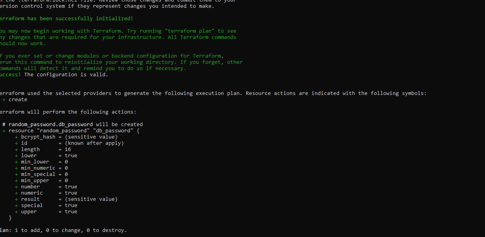

# AWS_Cloudops_Suite – Cloud Support & AWS Monitoring Lab

<!-- Project Status -->


<!-- GitHub Stats -->


<!-- Core Technologies -->


<!-- AWS Services -->


<!-- Social -->
[](https://linkedin.com/in/charles-bucher-cloud)
[](mailto:quietopscb@gmail.com)

---

## 🎯 TL;DR

**AWS_Cloudops_Suite** is a hands-on AWS monitoring and security lab built to learn cloud support skills through real deployments. Uses Terraform to deploy GuardDuty, CloudWatch, SNS, Lambda, S3, and IAM in an integrated monitoring solution.

- **Deploy Time:** ~30 minutes
- **Estimated Cost:** ~$15–30/month
- **Skills Focus:** AWS service integration, Infrastructure as Code, Python automation, security monitoring


---

## 📍 About This Project

**Pinellas Park, FL** | Self-taught, building cloud skills while working full-time as a delivery driver

I'm teaching myself AWS and cloud operations by building and deploying real infrastructure. This repo documents my learning process with actual deployments, working code, and real screenshots.

**Current Status:** Actively learning and iterating on this project over the past few weeks.

---

## 🔥 What This Lab Can Do

This project demonstrates capability to troubleshoot common cloud support scenarios:

### Scenario 1: EC2 Instance Connectivity
**Skills Demonstrated:**
- Security group configuration
- NACL troubleshooting
- Key pair management
- Route table validation

**Code:** [`scripts/runbook_example.py`](scripts/runbook_example.py)


---

### Scenario 2: IAM Permission Issues
**Skills Demonstrated:**
- Policy analysis
- Role trust relationships
- Bucket policy configuration
- Access troubleshooting

**Code:** [`scripts/remediation_example.py`](scripts/remediation_example.py)


---

### Scenario 3: Monitoring & Cost Management
**Skills Demonstrated:**
- CloudWatch metrics setup
- Dashboard creation
- Alarm configuration
- Cost optimization


---

## 🚀 Skills Being Developed

### AWS Services
- **Compute:** EC2, Lambda
- **Storage:** S3 (with versioning and encryption)
- **Monitoring:** CloudWatch (metrics, dashboards, alarms)
- **Security:** GuardDuty, IAM
- **Notifications:** SNS
- **Database:** DynamoDB (for Terraform state locking)

### Technical Skills
- Terraform (Infrastructure as Code)
- Python/Boto3 (AWS automation)
- Bash scripting
- Git version control
- GitHub Actions (CI/CD)

### Cloud Support Skills
- Service integration
- Log analysis
- Security configuration
- Troubleshooting workflows
- Documentation

---

## 🏗️ Architecture

```
┌─────────────────┐
│   GuardDuty     │──┐
│ (Threat Detect) │  │
└─────────────────┘  │
                     │    ┌──────────────┐
┌─────────────────┐  ├───→│   Lambda     │──→ Automated Response
│  CloudWatch     │──┘    │ (Functions)  │
│  (Monitoring)   │       └──────────────┘
└─────────────────┘            │
        │                      ↓
        ↓                  ┌──────────┐
   ┌────────┐             │   SNS    │──→ Notifications
   │   S3   │←────────────│ (Alerts) │
   │ (Logs) │             └──────────┘
   └────────┘
```

---

## 📊 What's Deployed

| Service | Purpose | Configuration |
|---------|---------|---------------|
| **GuardDuty** | Security threat detection | Enabled and configured |
| **CloudWatch** | Metrics & monitoring | Dashboards, alarms, metrics |
| **SNS** | Notifications | Email alerts configured |
| **Lambda** | Automation | Response functions deployed |
| **S3** | Log storage | Versioned, encrypted buckets |
| **IAM** | Access control | Least-privilege roles |
| **DynamoDB** | State management | Terraform state locking |

**Estimated Cost:** ~$15-30/month (based on AWS pricing calculator)

---

## 📸 Deployment Documentation

### 1️⃣ Environment Setup

<details>
<summary><b>Click to expand setup screenshots</b></summary>

#### AWS Access Configuration


#### Backend Configuration


#### Python Environment


#### AWS CLI Configuration


</details>

---

### 2️⃣ Terraform Deployment

<details>
<summary><b>Click to expand Terraform deployment screenshots</b></summary>

#### Initial Setup


#### Planning & Validation


#### Deployment


#### Lifecycle Management


</details>

---

### 3️⃣ Monitoring Configuration

<details>
<summary><b>Click to expand monitoring screenshots</b></summary>

#### CloudWatch Setup


#### Metrics Dashboards


#### DynamoDB State Management


#### Data Collection


</details>

---

### 4️⃣ IAM & Security

<details>
<summary><b>Click to expand IAM configuration screenshots</b></summary>

#### IAM Roles


#### User Permissions


</details>

---

### 5️⃣ Lambda Functions

<details>
<summary><b>Click to expand Lambda configuration screenshots</b></summary>

#### Lambda Deployment


</details>

---

### 6️⃣ Storage (S3)

<details>
<summary><b>Click to expand S3 configuration screenshots</b></summary>

#### S3 Buckets


</details>

---

### 7️⃣ CI/CD Pipeline

<details>
<summary><b>Click to expand CI/CD screenshots</b></summary>

#### GitHub Actions


</details>

---

### 8️⃣ Validation

<details>
<summary><b>Click to expand validation screenshots</b></summary>

#### Repo Validation


#### Additional Configuration


</details>

---

## ⚙️ How to Deploy

### Prerequisites

- AWS account with admin access
- Terraform 1.0+
- Python 3.8+
- AWS CLI configured
- Git

### Installation Steps

```bash
# 1. Clone the repository
git clone https://github.com/charles-bucher/AWS_Cloudops_Suite.git
cd AWS_Cloudops_Suite

# 2. Configure AWS credentials
aws configure
# Enter: Access Key, Secret Key, Region (us-east-1), Output format (json)

# 3. Set up Python virtual environment
python -m venv venv

# Windows:
.\venv\Scripts\activate

# Linux/macOS:
source venv/bin/activate

# 4. Install Python dependencies
pip install -r requirements.txt

# 5. Initialize Terraform
terraform init

# 6. Review deployment plan
terraform plan

# 7. Deploy infrastructure
terraform apply
# Type 'yes' when prompted

# 8. Verify deployment
python validate_repos.py
```

### Teardown

```bash
terraform destroy
# Type 'yes' when prompted
```

---

## 📁 Project Structure

```
AWS_Cloudops_Suite/
├── .github/workflows/      # CI/CD pipelines
├── diagrams/               # Architecture diagrams
├── docs/                   # Documentation
├── lambdas/                # Lambda function code
├── screenshots/            # Deployment evidence (28 screenshots)
├── scripts/                # Automation scripts
├── src/                    # Source code
├── terraform/              # Terraform modules
├── tests/                  # Test suite
├── main.tf                 # Main Terraform config
├── variables.tf            # Variable definitions
├── outputs.tf              # Output definitions
├── provider.tf             # AWS provider config
├── Backend.tf              # Remote state config
├── index.py                # Lambda entrypoint
├── requirements.txt        # Python dependencies
├── validate_repos.py       # Validation script
└── README.md               # This file
```

---

## 🎓 What I'm Learning

### Technical Capabilities
- Deploying multi-service AWS infrastructure with Terraform
- Writing Python automation scripts with Boto3
- Configuring security monitoring with GuardDuty
- Setting up CloudWatch dashboards and alarms
- Implementing CI/CD pipelines with GitHub Actions
- Managing remote Terraform state with S3 and DynamoDB

### Cloud Support Skills
- AWS service integration and configuration
- Infrastructure troubleshooting workflows
- Security best practices (least-privilege IAM, encryption)
- Cost-aware architecture design
- Documentation and runbook creation

---

## 🔐 Security Implementation

- Least-privilege IAM roles and policies
- Encrypted S3 buckets (AES-256)
- Versioned S3 buckets for data protection
- GuardDuty for threat detection
- Lambda functions for automated response
- CloudWatch alarms for monitoring
- Trivy security scanning in CI/CD

---

## 💰 Estimated Cost

| Service | Estimated Monthly Cost |
|---------|------------------------|
| GuardDuty | $5-10 |
| CloudWatch | $3-8 |
| S3 | $1-3 |
| Lambda | $0-2 (likely free tier) |
| SNS | $0-1 |
| DynamoDB | $0-1 (likely free tier) |
| **Total** | **~$15-30** |

*Estimates based on AWS pricing calculator for low-volume usage*

---

## 📄 License

This project is licensed under the **MIT License** - see the [LICENSE](LICENSE) file for details.

---

## 👤 Contact

**Charles Bucher**

- 📧 Email: quietopscb@gmail.com
- 💼 LinkedIn: [charles-bucher-cloud](https://linkedin.com/in/charles-bucher-cloud)
- 🐙 GitHub: [@charles-bucher](https://github.com/charles-bucher)

---

## 🎯 My Goals

**Learning Path:** Self-teaching cloud operations and AWS while working full-time  
**Target Roles:** Cloud Support Engineer, AWS Solutions Architect, DevOps Engineer  
**Focus:** Building practical, deployable skills through hands-on projects  

---

## 🔄 Recent Updates

- ✅ Organized screenshots and documentation (1 hour ago)
- ✅ Added CI/CD pipeline with GitHub Actions (Yesterday)
- ✅ Improved repository structure (3 days ago)
- ✅ Added Terraform and Trivy workflows (2 weeks ago)
- ✅ Merged monitoring and security components (3 weeks ago)

---

## 📊 Repository Stats


**Languages:**
- Python: 65.8%
- PowerShell: 24.4%
- HCL (Terraform): 9.8%

---

## 🤝 Contributing

This is a personal learning project, but I welcome feedback and suggestions!

1. Fork the repository
2. Create a feature branch (`git checkout -b feature/improvement`)
3. Commit your changes (`git commit -m 'Add improvement'`)
4. Push to the branch (`git push origin feature/improvement`)
5. Open a Pull Request

---

## ⭐ Support

If you find this project helpful for your own AWS learning:
- ⭐ Star the repository
- 🍴 Fork it to experiment with
- 💬 Open an issue with questions or suggestions

---

## 🔖 Topics

`python` `aws` `security` `devops` `monitoring` `serverless` `terraform` `incident-response` `cloudwatch` `infrastructure-monitoring` `infrastructure-as-code` `cloudops` `cloud-support` `guardduty` `cloud-automation` `hands-on-labs`

---

**Built while learning AWS in Pinellas Park, FL**

*"Learning by deploying, one service at a time."*

---

**© 2025 Charles Bucher**