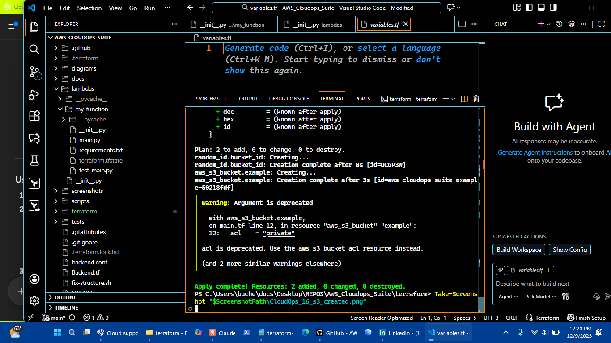

[](https://www.terraform.io/) 
[](https://aws.amazon.com/)
[](https://www.python.org/)
[](LICENSE)
[]()

# AWS CloudOps Suite


Hands-on AWS monitoring, alerting, and automation project built for learning CloudOps practices and demonstrating practical skills in **CloudWatch monitoring, Terraform infrastructure, Python automation, and GuardDuty security**.

---

## 📋 About

This project sets up a **full-stack AWS CloudOps environment**, including:

- **GuardDuty** for security monitoring
- **CloudWatch** for metrics and alerts
- **S3 Buckets** for findings storage
- **SNS** for notifications
- **Terraform** for infrastructure as code

It’s designed for **entry-level Cloud Support / CloudOps roles** to show practical skills.

---

## 🏗️ System Architecture

**CloudOps Pipeline Overview:**

1. **Terraform Deployment** – Sets up infrastructure including GuardDuty, CloudWatch alarms, SNS topics, and S3 buckets.
2. **Security Monitoring** – GuardDuty monitors threats and findings.
3. **Alerts & Automation** – CloudWatch alarms trigger notifications via SNS.
4. **Evidence Storage** – Findings stored in S3 buckets for auditing.


---

## 🚀 Quick Start

### Prerequisites

- AWS Free Tier account
- Terraform 1.0+
- Python 3.8+
- AWS CLI configured

---

### Installation

```bash
# Clone repository
git clone https://github.com/charles-bucher/AWS_Cloudops_Suite.git
cd AWS_Cloudops_Suite

# Create Python virtual environment
python -m venv venv

# Activate virtual environment
# Windows:
.\venv\Scripts\activate
# Linux/Mac:
source venv/bin/activate

# Install Python dependencies
pip install -r requirements.txt

# Configure AWS credentials
aws configure
Deploy Infrastructure
bash
Copy code
# Initialize Terraform
terraform init

# Review planned changes
terraform plan

# Apply infrastructure
terraform apply
Terraform Plan Screenshot:


Run Monitoring Scripts
bash
Copy code
# Activate virtual environment
.\venv\Scripts\activate

# Run GuardDuty findings monitor
python scripts/findings-monitor.py

# Run infrastructure health check
python scripts/health-check.py
## Implementation Evidence

### Terraform Plan Output


### AWS Configuration & Access


### CloudWatch & Monitoring


### DynamoDB & IAM


### Lambda & Metrics


### Python Scripts & S3




### Terraform Deployment


📚 Skills Demonstrated
Area	Technologies / Tools
Cloud Monitoring	CloudWatch metrics, alarms, dashboards
Security Monitoring	GuardDuty findings, automated alerts
Infrastructure as Code	Terraform (HCL), backend S3/DynamoDB
Automation	Python, Boto3 SDK, AWS CLI
Serverless	AWS Lambda functions
Storage & Databases	S3 buckets, DynamoDB tables
IAM & Security	Roles, policies, user permissions

🎯 Next Steps
Add RDS monitoring scenarios

Implement VPC flow log analysis

Build CI/CD pipeline with GitHub Actions

Add unit tests and cost monitoring

💼 Career Relevance
Skills highlighted in this project are applicable to:

Cloud Support Engineer

Junior DevOps / CloudOps Roles

Infrastructure as Code / AWS Automation

📝 License
This project is licensed under the MIT License. See the LICENSE file for details.

📧 Contact
Charles Bucher
📍 Pinellas Park, Florida
✉️ quietopscb@gmail.com
🔗 GitHub • LinkedIn

Keywords for ATS: AWS, CloudOps, Terraform, Python, CloudWatch, GuardDuty, Lambda, S3, DynamoDB, IAM, Infrastructure as Code, Boto3, Monitoring, Alerting, Security Automation, DevOps, Cloud Support, Incident Response, Observability
