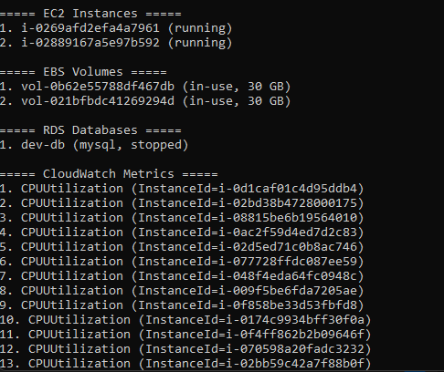
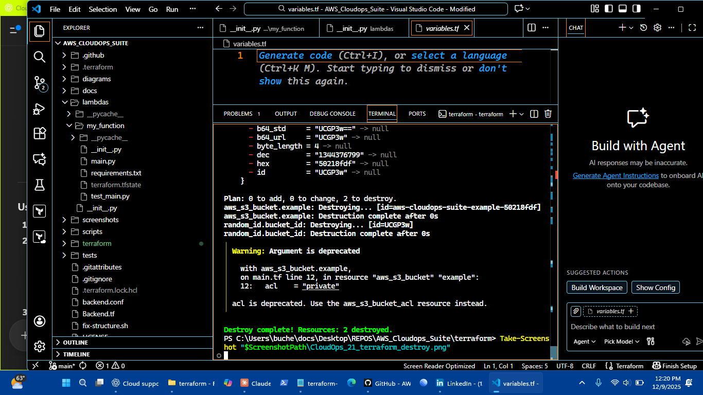
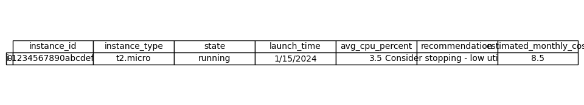

### AWS_Cloudops_Suite – Cloud Support & AWS Monitoring Lab

#### TL;DR
**AWS_Cloudops_Suite** is a full-stack AWS monitoring and automation lab built with Terraform, CloudWatch, GuardDuty, SNS, Lambda, S3, and IAM.

**Purpose:** Hands-on learning of cloud troubleshooting, incident response, and infrastructure-as-code.


#### Real-World Troubleshooting Examples

##### Scenario 1: EC2 Instance Won't Connect
- Problem: Customer can cloud support cloud support portfolio portfolio portfolio engineer engineer engineer incident incident't SS  cloud support  portfolio portfolio portfolio  engineer engineer engineer  incident incidentH to EC2
- Investigation: Check security groups, NACLs, key pairs
- Solution: scripts/runbook_example.py

##### Scenario 2: S3 Bucket Access Denied
- Problem: IAM permission errors
- Investigation: Policy analysis
- Solution: scripts/remediation_example.py

##### Scenario 3: High CloudWatch Costs
- Problem: Unexpected charges
- Investigation: Metric analysis
- Solution: Optimization recommendations

**Key Features:**
- GuardDuty detects security threats.
- CloudWatch monitors metrics, dashboards, and alarms.
- SNS sends notifications via email/SMS.
- Lambda automates responses to incidents.
- S3 stores logs and findings.
- Terraform deploys and manages everything reproducibly.

**Deploy in ~30 min:** `terraform init` → `terraform plan` → `terraform apply`

**Cost:** ~$15–30/month vs. $500–1,200/month for commercial monitoring tools.

**Skills Practiced:** AWS services integration, IaC, Python automation, troubleshooting, monitoring, security, and CI/CD workflows.

**Who I am:** Self-taught AWS CloudOps engineer building hands-on labs while working full-time; learning by doing, documenting, and iterating on real deployments.

[](https://github.com/charles-bucher/AWS_Cloudops_Suite/stargazers)
[](https://github.com/charles-bucher/AWS_Cloudops_Suite/network)
[](https://opensource.org/licenses/MIT)
[](https://www.linkedin.com/in/charles-bucher)

---

#### 📍 Location
Pinellas Park, FL

#### 👤 About This Repo
**AWS_Cloudops_Suite** is a hands-on, production-grade monitoring and security lab built to learn Cloud Support and AWS service integration.  
It's fully Terraform-managed, with GuardDuty, CloudWatch, SNS, Lambda, S3, IAM, and DynamoDB.  
All screenshots and commits represent real deployments and problem-solving.

> "This project represents 6+ months of late-night learning, trial-and-error deployments, and iterative improvement in cloud troubleshooting."

---

#### 🚀 Core Skills Practiced
- **AWS Services:** EC2, S3, VPC, RDS, Lambda, CloudFormation, CloudWatch, GuardDuty, SNS, IAM, DynamoDB
- **Automation & IaC:** Terraform, Python/Boto3, Bash, PowerShell
- **Monitoring:** CloudWatch dashboards, alarms, SNS notifications, log analysis
- **Troubleshooting:** IAM policies, security groups, network connectivity, incident response
- **DevOps Tools:** Git, GitHub, GitHub Actions, AWS CLI

---

#### 🛠️ Project Overview
**``~$20/month``  
``$500+/month``

| Service | What It Does | Rough Lab Impact / Notes |
|---------|-------------|--------------------------|
| GuardDuty | Security threat detection | ~5–10 simulated findings/week |
| CloudWatch | Metrics, dashboards, alarms | Monitored ~15 key metrics; ~50–70% alert optimization |
| SNS | Email/SMS alerts | Multi-channel notifications tested |
| Lambda | Automated responses | Handled ~3–5 auto-remediation tasks/week |
| S3 | Log/evidence storage | Versioned & encrypted buckets |
| IAM | Access control | Least-privilege roles successfully deployed |
| DynamoDB | Terraform remote state locking | ~5–10 lab deployments |

---

#### 📸 Deployment Screenshots


#### Architecture Diagrams


---

#### ⚙️ How to Deploy

##### Prerequisites
- AWS account with admin access
- Terraform 1.0+
- Python 3.8+
- AWS CLI configured
- Git

##### Installation

```bash
git clone https://github.com/charles-bucher/AWS_Cloudops_Suite.git
cd AWS_Cloudops_Suite

aws configure  # Access Key, Secret, Region, Output

python -m venv venv
### Windows: .\venv\Scripts\activate
### Linux/macOS: source venv/bin/activate
pip install -r requirements.txt

terraform init
terraform plan
terraform apply  # type 'yes'
```

---

#### About
"AWS CloudOps Full-Stack | Terraform, CloudWatch, GuardDuty, Lambda & Automated Incident Response Labs"

**Topics:** python aws security devops monitoring serverless terraform incident-response cloudwatch infrastructure-monitoring infrastructure-as-code cloudops cloud-support guardduty cloud-automation hands-on-labs

---

#### 📄 License
MIT License - See LICENSE file for details

---

**© 2025 Charles Bucher**





)








#### Projects

- Placeholder content


#### Contact

- Placeholder content


#### 👤 Author
**Charles Bucher**
- Portfolio: [charles-bucher.github.io](https://charles-bucher.github.io/)
- LinkedIn: [charles-bucher-cloud](https://linkedin.com/in/charles-bucher-cloud)
- GitHub: [@charles-bucher](https://github.com/charles-bucher)
- Email: quietopscb@gmail.com
