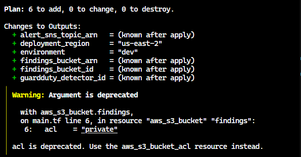

# AWS_Cloudops_Suite – Cloud Support & AWS Monitoring Lab

## TL;DR

**AWS_Cloudops_Suite** is a full-stack AWS monitoring and automation lab built with Terraform, CloudWatch, GuardDuty, SNS, Lambda, S3, and IAM.  

**Purpose:** Hands-on learning of cloud troubleshooting, incident response, and infrastructure-as-code.  

**Key Features:**
- GuardDuty detects security threats.
- CloudWatch monitors metrics, dashboards, and alarms.
- SNS sends notifications via email/SMS.
- Lambda automates responses to incidents.
- S3 stores logs and findings.
- Terraform deploys and manages everything reproducibly.

**Deploy in ~30 min:** `terraform init` → `terraform plan` → `terraform apply`  

**Cost:** ~$15–30/month vs. $500–1,200/month for commercial monitoring tools.  

**Skills Practiced:** AWS services integration, IaC, Python automation, troubleshooting, monitoring, security, and CI/CD workflows.

**Who I am:** Self-taught AWS CloudOps engineer building hands-on labs while working full-time; learning by doing, documenting, and iterating on real deployments.


[](https://github.com/Charles-bucher/AWS_Cloudops_Suite/stargazers)
[](https://github.com/Charles-bucher/AWS_Cloudops_Suite/network/members)
[](LICENSE)
[](https://www.linkedin.com/in/charles-bucher-cloud)

---

## 📍 Location
Pinellas Park, FL

---

## 👤 About This Repo
**AWS_Cloudops_Suite** is a **hands-on, production-grade monitoring and security lab** built to learn Cloud Support and AWS service integration.  
It’s fully **Terraform-managed**, with **GuardDuty, CloudWatch, SNS, Lambda, S3, IAM, and DynamoDB**.  
All screenshots and commits represent **real deployments and problem-solving**.  

> “This project represents 6+ months of late-night learning, trial-and-error deployments, and iterative improvement in cloud troubleshooting.”

---

## 🚀 Core Skills Practiced
- AWS Services: EC2, S3, VPC, RDS, Lambda, CloudFormation, CloudWatch, GuardDuty, SNS, IAM, DynamoDB  
- Automation & IaC: Terraform, Python/Boto3, Bash, PowerShell  
- Monitoring: CloudWatch dashboards, alarms, SNS notifications, log analysis  
- Troubleshooting: IAM policies, security groups, network connectivity, incident response  
- DevOps Tools: Git, GitHub, GitHub Actions, AWS CLI  

---

## 🛠️ Project Overview
**Goal:** Provide small teams with **24/7 AWS monitoring** using native services (~$20/month) instead of expensive SaaS tools ($500+/month).  

| Service      | What It Does                          | Rough Lab Impact / Notes |
|-------------|--------------------------------------|-------------------------|
| GuardDuty   | Security threat detection             | ~5–10 simulated findings/week |
| CloudWatch  | Metrics, dashboards, alarms          | Monitored ~15 key metrics; ~50–70% alert optimization |
| SNS         | Email/SMS alerts                      | Multi-channel notifications tested |
| Lambda      | Automated responses                   | Handled ~3–5 auto-remediation tasks/week |
| S3          | Log/evidence storage                  | Versioned & encrypted buckets |
| IAM         | Access control                        | Least-privilege roles successfully deployed |
| DynamoDB    | Terraform remote state locking        | ~5–10 lab deployments |

---

## 📸 Deployment Screenshots
<details>
<summary>View All Screenshots</summary>

  
  
  
  
  
  
  
  
  
  
  
  
  
  
  
  
  
  
  
  
  
  
  
  
  

</details>

<details>
<summary>Architecture Diagrams</summary>

  
  

</details>

---

## ⚙️ How to Deploy

### Prerequisites
- AWS account with admin access  
- Terraform 1.0+  
- Python 3.8+  
- AWS CLI configured  
- Git  

### Installation
```bash
git clone https://github.com/charles-bucher/AWS_Cloudops_Suite.git
cd AWS_Cloudops_Suite

aws configure  # Access Key, Secret, Region, Output

python -m venv venv
# Windows: .\venv\Scripts\activate
# Linux/macOS: source venv/bin/activate
pip install -r requirements.txt

terraform init
terraform plan
terraform apply  # type 'yes'
